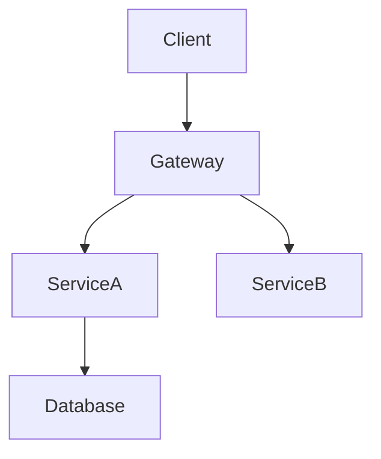
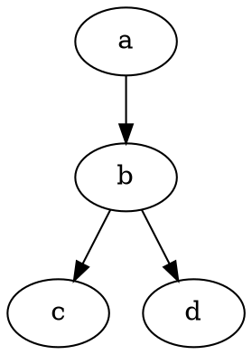
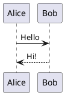

# AIChat Diagram Copy Preview

> Real-time preview for Mermaid, Graphviz DOT and PlantUML diagrams in VSCode — perfect companion for AI chat panels.

## Features

- **Real-time Preview**: Automatically renders Mermaid, DOT, and PlantUML diagrams in your editor
- **AI Chat Integration**: Copy diagram code from Copilot Chat or Claude Code, and see it rendered instantly
- **Multiple Languages**: Supports Mermaid, Graphviz DOT, and PlantUML
- **Theme Support**: Automatically adapts to your VSCode theme
- **Clipboard Monitoring**: Automatically detects and renders diagrams copied from AI chats
- **Large Diagram Handling**: Warns before rendering large diagrams to prevent performance issues

## Installation

### From VSIX (GitHub Release)

1. Download `aichat-diagram-copy-preview-0.1.0.vsix` from [Releases](https://github.com/zonsunny/vscode-graph-preview/releases)
2. In VSCode: `Cmd+Shift+P` → "Extensions: Install from VSIX"
3. Select the downloaded file

### From Source

```bash
git clone https://github.com/zonsunny/vscode-graph-preview.git
cd vscode-graph-preview
npm install
npm run compile
```

Then press F5 in VSCode to launch Extension Development Host.

## Usage

### From Editor

Open any file containing Mermaid, DOT, or PlantUML code blocks:

```markdown

```

The preview panel will automatically show the rendered diagram.

### From AI Chat

1. When Copilot Chat or Claude Code outputs a diagram code block
2. Click the copy button on the code block
3. AIChat Diagram Copy Preview automatically shows the rendered diagram

### Commands

- `AIChat Diagram Copy Preview: Open Preview Panel` - Open the preview panel
- `AIChat Diagram Copy Preview: Render from Clipboard` - Render diagram from clipboard content

## Configuration

| Setting | Default | Description |
|---------|---------|-------------|
| `aichat-diagram-copy-preview.autoOpen` | `true` | Automatically open preview when a diagram is detected |
| `aichat-diagram-copy-preview.watchClipboard` | `true` | Watch clipboard for diagram code |
| `aichat-diagram-copy-preview.debounceDelay` | `300` | Debounce delay (ms) for re-detection |
| `aichat-diagram-copy-preview.largeDiagramThreshold` | `500` | Node count threshold for large diagram warning |

## Supported Languages

### Mermaid

Flowcharts, sequence diagrams, class diagrams, state diagrams, ER diagrams, Gantt charts, and more.



### Graphviz DOT

Directed and undirected graphs using the DOT language.



### PlantUML

UML diagrams, sequence diagrams, component diagrams, and more.



## Privacy

- Clipboard monitoring only activates when the preview panel is open
- Can be disabled via `aichat-diagram-copy-preview.watchClipboard` setting
- Only matches diagram code formats, other content is ignored
- Clipboard content is not stored or logged

## Development

```bash
# Install dependencies
npm install

# Build
npm run compile

# Watch for changes
npm run watch

# Package
npx @vscode/vsce package
```

## License

MIT
