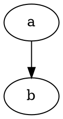
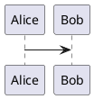

# VSCode Graph Preview — 插件方案文档

> 在 VSCode 中为 AI 对话（Copilot Chat / Claude Code）输出的 Mermaid / DOT / PlantUML 图表提供**实时可视化预览**。

---

## 1. 背景与动机

### 问题

Copilot Chat、Claude Code 等 AI 对话插件在 VSCode 中以 Webview 呈现对话内容。当 AI 输出 Mermaid、Graphviz (DOT)、PlantUML 等图表语言时，这些内容仅作为**纯文本代码块**展示，用户无法直观看到渲染结果。

### 为什么不能在聊天框内原地渲染？

VSCode 的安全架构决定了每个 Webview 是独立的沙盒 iframe，第三方扩展**没有 API** 可以操作其他扩展（如 Copilot Chat / Claude Code）的 Webview DOM。因此：

| 方案 | 可行性 | 原因 |
|------|--------|------|
| 注入 Copilot Chat Webview | ❌ 不可行 | Webview 安全隔离，无注入 API |
| 替换聊天面板 | ❌ 不可行 | 需要替换整个 Copilot Chat 扩展 |
| 旁侧独立预览面板 | ✅ 可行 | VSCode 原生支持 WebviewPanel |
| Hover Tooltip 浮层 | ✅ 可行 | `registerHoverProvider` 可在任何文本上生效 |

**本方案采用「旁侧独立预览面板」为主、「Hover 浮层」为辅的混合策略。**

---

## 2. 产品定位

### 一句话

> AI 写图，Graph Preview 帮你看图。

### 核心体验

```
┌──────────────────────────┬──────────────────────────┐
│  Copilot Chat / Claude   │  📊 Graph Preview        │
│                          │                          │
│  AI: 这是系统架构图       │     ┌──────┐            │
│                          │     │Client│            │
│  ```mermaid              │     └──┬───┘            │
│  graph TB                │        │                 │
│    Client --> Gateway    │     ┌──▼───┐            │
│    Gateway --> ServiceA  │     │Gateway│           │
│    Gateway --> ServiceB  │     └──┬───┘            │
│    ServiceA --> DB       │    ┌───┴───┐            │
│  ```                     │    │       │            │
│                          │  ┌─▼─┐  ┌─▼──┐         │
│  ```dot                  │  │SvcA│  │SvcB│         │
│  digraph {               │  └─┬─┘  └────┘         │
│    a -> b -> c;          │    │                    │
│  }                       │  ┌─▼─┐                 │
│  ```                     │  │ DB│                  │
│                          │  └───┘                  │
└──────────────────────────┴──────────────────────────┘
```

### 目标用户

- 使用 Copilot Chat / Claude Code 生成架构图、流程图的开发者
- 在代码注释或文档中编写 Mermaid/DOT/PlantUML 的开发者
- 任何需要在 VSCode 中快速预览图表的人

---

## 3. 功能设计

### 3.1 核心功能

| 功能 | 说明 | 优先级 |
|------|------|--------|
| 实时预览面板 | 侧边栏 Webview，自动检测并渲染当前编辑器中的图表代码块 | P0 |
| 多语言支持 | Mermaid / Graphviz DOT / PlantUML | P0 |
| Hover 浮层 | 鼠标悬停在代码块上时弹出小型预览 | P1 |
| 导出 SVG/PNG | 一键导出当前预览为图片文件 | P1 |
| 错误提示 | 渲染失败时显示行号和错误原因 | P1 |
| 多图切换 | 文档中包含多个代码块时，可切换预览不同图表 | P2 |

### 3.2 交互设计

#### 自动检测 & 实时预览（主路径）

1. 用户在任意编辑器中输入/查看包含图表代码块的文本
2. 插件自动检测到代码块（无需手动触发）
3. Graph Preview 面板**自动更新**渲染结果
4. 文档滚动时，面板跟踪当前可见的代码块

#### 手动触发（备选路径）

- 命令面板：`Graph Preview: Render Current Block`
- 快捷键：`Cmd+Shift+G`（可自定义）
- 右键菜单：选中代码块 → "Preview as Graph"
- 代码块右上角 CodeLens：`▶ Preview` 按钮

#### Hover 浮层

- 鼠标悬停在 mermaid/dot/plantuml 代码块上 300ms 后弹出
- 显示小型渲染预览（最大 400×300px）
- 点击浮层可打开完整预览面板

### 3.3 不做的事

- ❌ 不支持在预览中反向编辑代码块（保持单向：代码 → 图）
- ❌ 不尝试注入其他扩展的 Webview
- ❌ 不依赖在线服务渲染（PlantUML 除外，见 §5.3）

---

## 4. 技术架构

### 4.1 整体架构

```
┌─────────────────────────────────────────────┐
│                VSCode Extension Host         │
│                                             │
│  ┌──────────┐  ┌──────────┐  ┌───────────┐ │
│  │ Detector │  │ Renderer │  │  Exporter │ │
│  │ Module   │→ │ Manager  │  │  Module   │ │
│  └──────────┘  └──────────┘  └───────────┘ │
│       ↑              ↓                      │
│  ┌──────────┐  ┌──────────┐                │
│  │ Editor   │  │ Webview  │                │
│  │ Watcher  │  │  Panel   │                │
│  └──────────┘  └──────────┘                │
│       ↑              ↓                      │
│  ┌──────────┐  ┌──────────┐                │
│  │ Hover    │  │ CodeLens │                │
│  │Provider  │  │Provider  │                │
│  └──────────┘  └──────────┘                │
└─────────────────────────────────────────────┘
```

### 4.2 模块职责

| 模块 | 文件 | 职责 |
|------|------|------|
| **Detector** | `src/detector.ts` | 扫描活动编辑器，提取所有图表代码块（语言类型 + 内容 + 行号范围） |
| **Renderer Manager** | `src/renderer-manager.ts` | 管理渲染器实例，分发渲染任务，处理渲染结果/错误 |
| **Mermaid Renderer** | `src/renderers/mermaid.ts` | 在 Webview 中用 `mermaid.js` 渲染 |
| **Graphviz Renderer** | `src/renderers/graphviz.ts` | 在 Webview 中用 `@viz-js/viz`（Graphviz WASM）渲染 DOT 语言 |
| **PlantUML Renderer** | `src/renderers/plantuml.ts` | 编码后发送到 PlantUML Server 渲染，或本地 Java 渲染 |
| **Editor Watcher** | `src/editor-watcher.ts` | 监听 `onDidChangeActiveTextEditor` + `onDidChangeTextDocument`，驱动检测循环 |
| **Webview Panel** | `src/preview-panel.ts` | 管理预览面板的创建/更新/销毁，向 Webview 传递渲染指令 |
| **Hover Provider** | `src/hover-provider.ts` | 注册 Hover Provider，在代码块上显示浮层预览 |
| **CodeLens Provider** | `src/codelens-provider.ts` | 在代码块首行显示 `▶ Preview` 链接 |
| **Exporter** | `src/exporter.ts` | 从 Webview 中提取 SVG，转换为 PNG 并保存到文件系统 |

### 4.3 Extension ↔ Webview 通信协议

```typescript
// Extension → Webview
interface RenderMessage {
  type: 'render';
  id: string;              // 代码块唯一标识
  language: 'mermaid' | 'dot' | 'plantuml';
  code: string;            // 图表源码
  theme: 'light' | 'dark'; // 跟随 VSCode 主题
}

// Webview → Extension
interface ReadyMessage {
  type: 'ready';
}

interface ExportMessage {
  type: 'export';
  id: string;
  format: 'svg' | 'png';
  data: string;            // base64 编码的图片数据
}

interface ErrorMessage {
  type: 'error';
  id: string;
  message: string;
  line?: number;           // 错误行号（如果可解析）
}
```

---

## 5. 渲染器技术选型

### 5.1 Mermaid

| 项目 | 选择 |
|------|------|
| 渲染库 | `mermaid` (npm) |
| 版本 | ^11.x（最新稳定版） |
| 渲染方式 | 在 Webview 中通过 `<script>` 引入，调用 `mermaid.render()` |
| 主题适配 | 自动映射 VSCode 主题到 mermaid 主题（dark/default/forest/neutral） |

**实现要点**：
```typescript
// Webview 中的渲染逻辑
async function renderMermaid(code: string, id: string) {
  const { svg } = await mermaid.render(`graph-${id}`, code);
  container.innerHTML = svg;
}
```

### 5.2 Graphviz (DOT)

| 项目 | 选择 |
|------|------|
| 渲染库 | `@viz-js/viz` (npm) |
| 原理 | Graphviz 编译为 WebAssembly，纯浏览器端渲染 |
| 渲染方式 | Webview 中加载 WASM，调用 `viz.renderSVGElement(dotCode)` |
| 离线能力 | ✅ 完全离线，无需外部依赖 |

**实现要点**：
```typescript
import { Viz } from '@viz-js/viz';

const viz = await Viz.instance();
const svgElement = viz.renderSVGElement(dotCode);
container.appendChild(svgElement);
```

### 5.3 PlantUML

| 项目 | 选择 |
|------|------|
| 方案 A（默认） | PlantUML 在线 Server（`plantuml.com` 或自建） |
| 方案 B（离线） | 本地 Java + plantuml.jar（需用户安装 Java） |
| 编码 | `plantuml-encoder` (npm) — 将 PlantUML 源码编码为 URL |
| 渲染方式 | 方案 A 通过 `` 加载服务端返回的 SVG；方案 B 通过 `child_process` 调用本地命令 |

**默认使用方案 A**，在设置中提供切换到方案 B 的选项。

---

## 6. 代码块检测算法

### 6.1 支持的代码块格式

````markdown





````

### 6.2 检测逻辑

```typescript
interface GraphBlock {
  id: string;              // 唯一标识
  language: GraphLanguage;
  code: string;            // 去掉围栏后的纯源码
  range: vscode.Range;     // 在文档中的位置
  fenceRange: vscode.Range;// 包括围栏行的完整范围
}

type GraphLanguage = 'mermaid' | 'dot' | 'plantuml';

const FENCE_PATTERN = /```(mermaid|dot|graphviz|plantuml|puml)\s*\n([\s\S]*?)```/g;
```

### 6.3 性能优化

- **防抖**：编辑器内容变化后 300ms 再执行检测（避免高频输入时反复解析）
- **增量检测**：仅重新解析 `onDidChangeTextDocument` 事件中的变化区域
- **缓存**：相同代码块内容 + 语言 → 不重复渲染（hash 比对）
- **惰性加载**：Graphviz WASM (~3MB) 在首次需要时才加载

### 6.4 内容验证（排除非图表代码）

仅匹配语言标识不足以判断内容是否为有效图表。需要增加内容验证层，避免误触发预览。

#### 需要排除的场景

| 场景 | 示例 | 是否预览 |
|------|------|----------|
| 空代码块 | ` ```mermaid\n``` ` | ❌ |
| 纯配置代码 | `%%{init: {'theme': 'dark'}}` | ❌ |
| 纯注释 | `%% 这是一个注释` | ❌ |
| 教程示例中的占位符 | `graph TB\n  %% 在这里填写你的图表` | ❌ |
| 有效的图表代码 | `graph TB\n  A --> B` | ✅ |

#### 验证逻辑

```typescript
function isValidGraphContent(language: GraphLanguage, code: string): boolean {
  const trimmed = code.trim();
  
  // 排除空内容
  if (!trimmed) return false;
  
  // 排除纯注释（以 %% 开头且没有其他内容）
  if (/^%%(?!{)/m.test(trimmed) && !hasGraphKeywords(trimmed, language)) {
    return false;
  }
  
  switch (language) {
    case 'mermaid':
      return isValidMermaid(trimmed);
    case 'dot':
      return isValidDot(trimmed);
    case 'plantuml':
      return isValidPlantUml(trimmed);
    default:
      return false;
  }
}

function isValidMermaid(code: string): boolean {
  // Mermaid 必须以图表类型关键字开头
  const MERMAID_KEYWORDS = /^(graph|flowchart|sequenceDiagram|classDiagram|stateDiagram-v2|stateDiagram|erDiagram|journey|gantt|pie|gitGraph|mindmap|timeline|quadrantChart|requirementDiagram|C4Context|C4Container|C4Component|C4Dynamic|C4Deployment|info|packet-beta|block-beta|architecture-beta|kanban|sankey|xychart-beta)/m;
  
  // 排除纯配置（%%{init:...}）
  if (/^%%\{init:/.test(code.trim()) && !MERMAID_KEYWORDS.test(code)) {
    return false;
  }
  
  return MERMAID_KEYWORDS.test(code);
}

function isValidDot(code: string): boolean {
  // DOT 必须包含 graph/digraph/subgraph 关键字，或边定义（-> / --）
  return /^(strict\s+)?(digraph|graph|subgraph)\b/m.test(code)
      || /->|--/.test(code);
}

function isValidPlantUml(code: string): boolean {
  // PlantUML 必须有 @startXXX/@endXXX 或关键字
  const hasStartEnd = /@start(uml|ditaa|dot|jcckit|math|salt|tree|wbs|mindmap|gantt|chronology|wire|json|yaml)/.test(code);
  
  const hasKeywords = /^(actor|participant|usecase|class|interface|enum|abstract|state|activity|partition|rectangle|package|node|folder|frame|cloud|database|storage|agent|artifact|boundary|card|circle|collections|component|control|entity|file|hexagon|label|person|queue|stack|title|skinparam|!define|!include|!function)/m.test(code);
  
  return hasStartEnd || hasKeywords;
}

function hasGraphKeywords(code: string, language: GraphLanguage): boolean {
  // 通用检查：代码中是否包含有效的图表结构
  switch (language) {
    case 'mermaid':
      return isValidMermaid(code);
    case 'dot':
      return isValidDot(code);
    case 'plantuml':
      return isValidPlantUml(code);
    default:
      return false;
  }
}
```

---

## 7. 项目结构

```
vscode-graph-preview/
├── package.json                 # 扩展清单 & 发布配置
├── tsconfig.json
├── esbuild.js                   # 构建脚本
├── .vscodeignore
├── LICENSE                      # MIT
├── README.md                    # GitHub 首页文档
├── CHANGELOG.md
│
├── src/
│   ├── extension.ts             # activate() 入口，注册所有命令和 provider
│   ├── detector.ts              # 代码块检测器
│   ├── editor-watcher.ts        # 编辑器事件监听 & 检测驱动
│   ├── renderer-manager.ts      # 渲染器调度
│   ├── preview-panel.ts         # Webview 预览面板
│   ├── hover-provider.ts        # Hover 浮层
│   ├── codelens-provider.ts     # CodeLens 按钮
│   ├── exporter.ts              # SVG/PNG 导出
│   ├── utils.ts                 # 通用工具函数
│   │
│   └── renderers/
│       ├── mermaid-renderer.ts
│       ├── graphviz-renderer.ts
│       └── plantuml-renderer.ts
│
├── media/                       # Webview 静态资源（打包进扩展）
│   ├── index.html               # 预览面板 HTML 模板
│   ├── preview.js               # Webview 内的渲染逻辑
│   ├── preview.css              # 预览面板样式
│   └── libs/
│       ├── mermaid.min.js       # Mermaid 库
│       └── viz.js               # @viz-js/viz WASM bundle
│
├── icons/                       # 扩展图标
│   └── graph-preview-icon.png
│
└── .github/
    └── workflows/
        └── ci.yml               # CI: lint + build + test
```

---

## 8. 扩展清单 (package.json) 关键配置

```jsonc
{
  "name": "graph-preview",
  "displayName": "Graph Preview",
  "description": "Real-time preview for Mermaid, Graphviz DOT and PlantUML diagrams in VSCode — perfect companion for AI chat panels.",
  "version": "0.1.0",
  "publisher": "your-github-username",
  "license": "MIT",
  "keywords": ["mermaid", "graphviz", "plantuml", "diagram", "preview", "ai"],
  "engines": { "vscode": "^1.85.0" },
  "categories": ["Visualization", "Programming Languages"],
  "activationEvents": [
    "onCommand:graph-preview.openPanel",
    "onCommand:graph-preview.renderBlock",
    "onLanguage:markdown",
    "onLanguage:plaintext"
  ],
  "main": "./out/extension.js",
  "contributes": {
    "viewsContainers": {
      "activitybar": [{
        "id": "graph-preview-sidebar",
        "title": "Graph Preview",
        "icon": "./icons/graph-preview-icon.png"
      }]
    },
    "views": {
      "graph-preview-sidebar": [{
        "id": "graph-preview",
        "name": "Graph Preview",
        "type": "webview"
      }]
    },
    "commands": [
      {
        "command": "graph-preview.openPanel",
        "title": "Graph Preview: Open Preview Panel",
        "icon": "$(graph)"
      },
      {
        "command": "graph-preview.renderBlock",
        "title": "Graph Preview: Render Current Block",
        "keybinding": "cmd+shift+g"
      },
      {
        "command": "graph-preview.renderFromClipboard",
        "title": "Graph Preview: Render from Clipboard"
      },
      {
        "command": "graph-preview.renderFromClipboardAsMermaid",
        "title": "Graph Preview: Render from Clipboard as Mermaid"
      },
      {
        "command": "graph-preview.renderFromClipboardAsDot",
        "title": "Graph Preview: Render from Clipboard as DOT"
      },
      {
        "command": "graph-preview.renderFromClipboardAsPlantUml",
        "title": "Graph Preview: Render from Clipboard as PlantUML"
      },
      {
        "command": "graph-preview.exportSVG",
        "title": "Graph Preview: Export as SVG"
      },
      {
        "command": "graph-preview.exportPNG",
        "title": "Graph Preview: Export as PNG"
      },
      {
        "command": "graph-preview.showWelcome",
        "title": "Graph Preview: Show Welcome Guide"
      }
    ],
    "configuration": {
      "title": "Graph Preview",
      "properties": {
        "graph-preview.autoOpen": {
          "type": "boolean",
          "default": true,
          "description": "Automatically open preview panel when a graph code block is detected"
        },
        "graph-preview.plantuml.serverUrl": {
          "type": "string",
          "default": "https://www.plantuml.com/plantuml",
          "description": "PlantUML server URL (set to 'local' for local Java rendering)"
        },
        "graph-preview.mermaid.theme": {
          "type": "string",
          "enum": ["default", "dark", "forest", "neutral"],
          "default": "default",
          "description": "Mermaid theme (auto-overridden by VSCode theme if set to 'default')"
        },
        "graph-preview.debounceDelay": {
          "type": "number",
          "default": 300,
          "description": "Debounce delay (ms) for re-detecting code blocks after editing"
        },
        "graph-preview.watchClipboard": {
          "type": "boolean",
          "default": true,
          "description": "Watch clipboard for graph code blocks and auto-preview (only active when panel is open)"
        },
        "graph-preview.largeDiagramThreshold": {
          "type": "number",
          "default": 500,
          "description": "Estimated node count threshold for large diagram warning (0 to disable warning)"
        },
        "graph-preview.renderTimeout": {
          "type": "number",
          "default": 5000,
          "description": "Render timeout in milliseconds (0 to disable timeout)"
        }
      }
    }
  }
}
```

---

## 9. 构建与发布

### 9.1 开发环境

```bash
# 初始化项目
npm init -y
npm install -D typescript @types/vscode @types/node esbuild

# 安装渲染库（用于 Webview）
npm install mermaid @viz-js/viz plantuml-encoder

# 开发调试
# F5 in VSCode → 打开 Extension Development Host
```

### 9.2 构建脚本 (esbuild.js)

```javascript
const esbuild = require('esbuild');

esbuild.build({
  entryPoints: ['src/extension.ts'],
  bundle: true,
  outfile: 'out/extension.js',
  external: ['vscode'],
  format: 'cjs',
  platform: 'node',
  minify: true,
  sourcemap: true,
}).catch(() => process.exit(1));
```

### 9.3 发布到 VSCode Marketplace

```bash
npx @vscode/vsce package    # 打包 .vsix
npx @vscode/vsce publish     # 发布（需要 Marketplace Publisher 账号）
```

### 9.4 CI/CD (.github/workflows/ci.yml)

```yaml
name: CI
on: [push, pull_request]
jobs:
  build:
    runs-on: ubuntu-latest
    steps:
      - uses: actions/checkout@v4
      - uses: actions/setup-node@v4
        with: { node-version: 20 }
      - run: npm ci
      - run: npm run compile
      - run: npm run lint
      - run: npm test
```

---

## 10. 关键技术风险与对策

| 风险 | 影响 | 对策 |
|------|------|------|
| Graphviz WASM 首次加载慢（~3MB） | 首次打开 DOT 图表有延迟 | 显示加载进度条；缓存到 `globalStorage` |
| PlantUML 在线服务不稳定 | 渲染失败 | 支持自定义 Server URL；提供本地 Java 方案 |
| Mermaid 渲染大面积图表卡顿 | 预览面板无响应 | 设置渲染超时；超大图降级为"点击查看" |
| Copilot Chat Webview 内容获取不到 | 无法自动检测聊天中的代码块 | 方案见 §11 |
| VSCode 主题切换后图表颜色不匹配 | 视觉不协调 | 监听 `onDidChangeActiveColorTheme`，自动重新渲染 |
| 用户复制非图表代码 | 误触发预览 | 内容验证层（见 §6.4） |
| 用户首次安装不知道如何使用 | 流失用户 | 首次使用引导（见 §3.4） |

### 10.1 大型图表降级策略

为防止大型图表导致预览面板卡顿或无响应，需要实现降级策略：

#### 阈值定义

| 指标 | 阈值 | 来源 |
|------|------|------|
| 代码行数 | > 200 行 | 简单计数 |
| 节点数量（估算） | > 500 个 | 正则匹配节点定义 |
| 渲染超时 | > 5 秒 | Webview 计时 |

#### 降级 UI

当检测到大型图表时，不直接渲染，而是显示：

```
┌─────────────────────────────────────┐
│  ⚠️ Large Diagram Detected          │
│                                     │
│  This diagram has ~600 nodes and    │
│  may take a while to render.        │
│                                     │
│  [Render Anyway]  [Export as File]  │
│                                     │
│  💡 Tip: You can adjust the         │
│  threshold in settings.             │
└─────────────────────────────────────┘
```

#### 配置项

```jsonc
{
  "graph-preview.largeDiagramThreshold": {
    "type": "number",
    "default": 500,
    "description": "Estimated node count threshold for large diagram warning (0 to disable)"
  },
  "graph-preview.renderTimeout": {
    "type": "number",
    "default": 5000,
    "description": "Render timeout in milliseconds (0 to disable)"
  }
}
```

### 10.2 首次使用引导

为降低新用户的学习成本，需要在首次安装时提供引导：

#### 引导触发条件

- 扩展首次激活时
- 或用户手动触发 `Graph Preview: Show Welcome`

#### 引导内容

```
┌─────────────────────────────────────────────────────┐
│  🎉 Welcome to Graph Preview!                       │
│                                                     │
│  Quickly preview Mermaid, DOT, and PlantUML         │
│  diagrams right in VSCode.                          │
│                                                     │
│  ━━━━━━━━━━━━━━━━━━━━━━━━━━━━━━━━━━━━━━━━━━━━━━━━━━━│
│                                                     │
│  📋 Works with AI Chat                              │
│                                                     │
│  When Copilot Chat outputs a diagram, just click    │
│  the copy button on the code block, and Graph       │
│  Preview will automatically show the rendered       │
│  diagram.                                           │
│                                                     │
│  ━━━━━━━━━━━━━━━━━━━━━━━━━━━━━━━━━━━━━━━━━━━━━━━━━━━│
│                                                     │
│  ⌨️ Quick Commands                                  │
│                                                     │
│  • Cmd+Shift+G  Render current block                │
│  • Open sidebar  Click the graph icon               │
│                                                     │
│  ━━━━━━━━━━━━━━━━━━━━━━━━━━━━━━━━━━━━━━━━━━━━━━━━━━━│
│                                                     │
│  [ ] Don't show this again                          │
│                                                     │
│  [Start Using]  [View Documentation]                │
└─────────────────────────────────────────────────────┘
```

#### 状态栏入口

在 VSCode 状态栏添加快捷入口，方便用户快速打开预览面板：

```typescript
const statusBarItem = vscode.window.createStatusBarItem(
  vscode.StatusBarAlignment.Right,
  100
);
statusBarItem.text = '$(graph) Graph Preview';
statusBarItem.command = 'graph-preview.openPanel';
statusBarItem.tooltip = 'Open Graph Preview Panel';
statusBarItem.show();
```

---

## 11. Copilot Chat / Claude Code 适配策略

这是本方案最关键的技术挑战。

### 问题

Copilot Chat 和 Claude Code 的对话内容运行在它们各自的 Webview 中，我们的扩展**无法直接读取**这些 Webview 的 DOM。这是 VSCode 安全架构的硬性限制。

### 方案：剪贴板监听 + 手动命令

#### 主方案：剪贴板监听（自动预览）

监听系统剪贴板，当检测到复制的图表代码块时自动弹出预览：

```typescript
// 用户在 Copilot Chat 中点击代码块「复制」按钮 → 自动检测并预览
async function startClipboardWatcher() {
  const text = await vscode.env.clipboard.readText();
  const block = detectClipboardContent(text);
  if (block) {
    showPreview(block);
  }
}

// 轮询间隔 500ms（仅在面板打开时启用）
const clipboardInterval = setInterval(startClipboardWatcher, 500);
```

**用户体验**：
```
Copilot Chat 输出图表代码 → 用户点击代码块右上角「复制」按钮 → Graph Preview 自动弹出渲染
```

用户只需**点击一次复制按钮**，无需切换面板或粘贴。

### 剪贴板格式容错

用户复制的内容可能是不同格式，需要智能识别：

#### 支持的格式

| 格式 | 示例 | 识别方式 |
|------|------|----------|
| **完整围栏** | ` ```mermaid\ngraph TB\n  A --> B\n``` ` | 正则匹配围栏 + 语言标识 |
| **纯代码（可推断）** | `graph TB\n  A --> B` | 内容验证 + 语言推断 |
| **纯代码（不可推断）** | 模糊代码片段 | 提示用户选择语言 |

#### 检测逻辑

```typescript
interface ClipboardDetectionResult {
  status: 'success' | 'ambiguous' | 'invalid';
  block?: GraphBlock;          // 成功时返回
  candidates?: GraphLanguage[]; // 模糊时返回候选语言
}

function detectClipboardContent(text: string): ClipboardDetectionResult {
  // 格式 1：尝试匹配带围栏的完整代码块
  const fencedMatch = text.match(/```(mermaid|dot|graphviz|plantuml|puml)\s*\n([\s\S]*?)```/);
  if (fencedMatch) {
    const language = normalizeLanguage(fencedMatch[1]);
    const code = fencedMatch[2].trim();
    if (isValidGraphContent(language, code)) {
      return { status: 'success', block: { language, code } };
    }
  }
  
  // 格式 2：尝试推断纯代码的语言
  const trimmed = text.trim();
  const candidates: GraphLanguage[] = [];
  
  if (isValidMermaid(trimmed)) candidates.push('mermaid');
  if (isValidDot(trimmed)) candidates.push('dot');
  if (isValidPlantUml(trimmed)) candidates.push('plantuml');
  
  if (candidates.length === 1) {
    return { status: 'success', block: { language: candidates[0], code: trimmed } };
  }
  
  if (candidates.length > 1) {
    // 多个候选，提示用户选择
    return { status: 'ambiguous', candidates };
  }
  
  // 无法识别
  return { status: 'invalid' };
}
```

#### 模糊情况的处理

当 `status: 'ambiguous'` 时，显示语言选择提示：

```
┌─────────────────────────────────────┐
│  🔍 Detected multiple possibilities │
│                                     │
│  This code could be:                │
│                                     │
│  [Mermaid]  [DOT]  [PlantUML]       │
│                                     │
│  ─────────────────────────────────  │
│  graph TB                           │
│    A --> B                          │
└─────────────────────────────────────┘
```

#### 保底方案：手动命令

当自动检测失效或用户偏好手动控制时：

```
命令面板 → "Graph Preview: Render from Clipboard"
命令面板 → "Graph Preview: Render from Clipboard as Mermaid"
命令面板 → "Graph Preview: Render from Clipboard as DOT"
命令面板 → "Graph Preview: Render from Clipboard as PlantUML"
快捷键 → Cmd+Shift+G
```

### 隐私保护措施

剪贴板监听涉及隐私，必须谨慎处理：

| 措施 | 说明 |
|------|------|
| **仅面板打开时启用** | Graph Preview 面板关闭时不监听剪贴板 |
| **配置项开关** | `graph-preview.watchClipboard: true/false`，默认 true |
| **格式匹配** | 仅匹配图表代码格式，其他内容立即丢弃 |
| **不存储** | 剪贴板内容仅用于即时渲染，不写入文件或日志 |
| **UI 提示** | 面板标题栏显示「📋 监听剪贴板」状态指示 |
| **一键禁用** | 点击状态指示可快速关闭监听 |

### 技术限制说明

| 尝试过的方案 | 为什么不可行 |
|-------------|-------------|
| 注入 Copilot Chat Webview | VSCode Webview 安全隔离，无注入 API |
| 监听 `copilot-chat` URI scheme | Copilot Chat 不产生可访问的 TextDocument |
| 读取 Copilot Chat 内部状态 | 扩展间无共享状态 API |

**结论**：剪贴板监听是当前 VSCode 架构下唯一可行的自动化方案。

---

## 12. 开发路线图

### Phase 1 — MVP（2 周）

- [ ] 项目脚手架搭建（TypeScript + esbuild）
- [ ] 代码块检测器（Mermaid + DOT + PlantUML）
- [ ] 预览面板（Webview，Mermaid 渲染）
- [ ] 编辑器内容监听 & 自动更新
- [ ] 基础导出（SVG）
- [ ] 基本配置项

### Phase 2 — 完善（2 周）

- [ ] Graphviz WASM 渲染
- [ ] PlantUML 渲染（在线 Server）
- [ ] Hover 浮层预览
- [ ] CodeLens 按钮
- [ ] PNG 导出
- [ ] 主题跟随（dark/light）
- [ ] 多图切换

### Phase 3 — 生态（2 周）

- [ ] Clipboard 监听自动预览（含隐私保护措施）
- [ ] 隐私配置项 & UI 状态指示
- [ ] README / 文档 / 示例
- [ ] VSCode Marketplace 发布
- [ ] GitHub Actions CI/CD
- [ ] 用户反馈收集

---

## 13. 开源运营

### 仓库名称

`vscode-graph-preview`

### 许可证

MIT

### README 结构

```
# Graph Preview

> Real-time diagram preview for VSCode — Mermaid, Graphviz DOT, PlantUML

## Features
## Preview
## Installation
## Usage
## Configuration
## Supported Languages
## Contributing
## License
```

### 推广渠道

- VSCode Marketplace（自然流量）
- Reddit r/vscode, r/webdev
- Hacker News Show HN
- Twitter/X
- 掘金 / V2EX（中文社区）

---

## 14. 总结

| 维度 | 决策 |
|------|------|
| 产品形态 | VSCode 侧边栏 Webview 预览面板 + Hover 浮层 + 状态栏入口 |
| 支持语言 | Mermaid / Graphviz DOT / PlantUML |
| 渲染方式 | Mermaid.js + @viz-js/viz (WASM) + PlantUML Server |
| 编辑能力 | 不支持（单向：代码 → 图） |
| AI 对话适配 | 剪贴板监听（点击复制 → 自动预览）+ 格式容错 + 语言推断 |
| 内容验证 | 排除空块/纯配置/纯注释，确保有效图表 |
| 大图处理 | 阈值检测 + 降级 UI + 超时保护 |
| 新手引导 | 首次欢迎面板 + 状态栏快捷入口 |
| 技术栈 | TypeScript + esbuild + VSCode Extension API |
| 开源协议 | MIT |
| 预估工期 | MVP 2 周，完整版 6 周 |