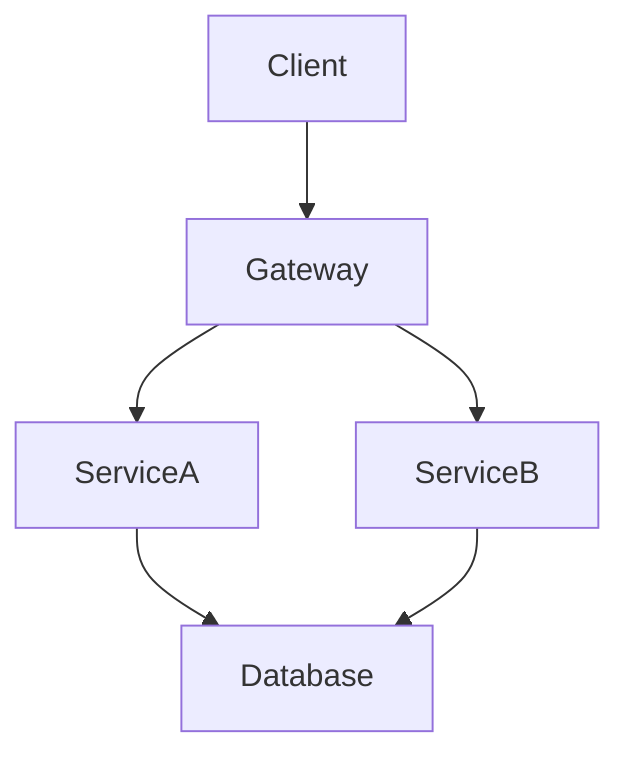
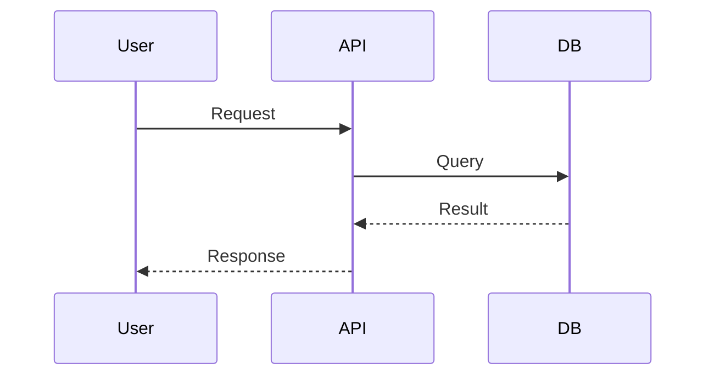
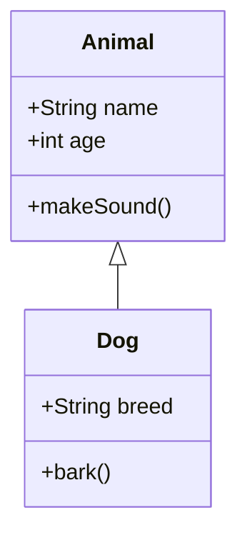
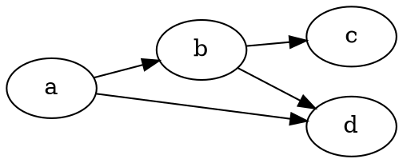
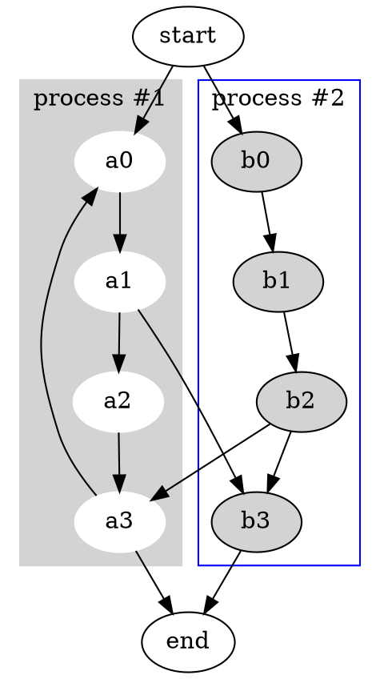
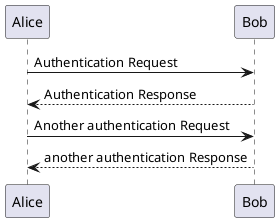
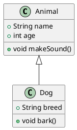

# Graph Preview Test File

This file contains various diagram code blocks for testing the Graph Preview extension.

## Mermaid Tests

### Simple Flowchart



### Sequence Diagram



### Class Diagram



## DOT Tests

### Simple Graph



### Complex Graph



## PlantUML Tests

### Sequence Diagram



### Class Diagram



## Edge Cases

### Empty Block (should not render)

```mermaid
```

### Config Only (should not render)

```mermaid
%%{init: {'theme': 'dark'}}
```

### Comment Only (should not render)

```mermaid
%% This is just a comment
```
